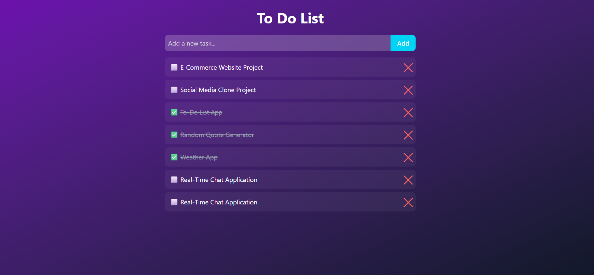

# 📝 React + Tailwind CSS To-Do List App

A modern and minimal **To-Do List** application built with **React**, **Tailwind CSS**, and **React Hooks**, featuring **local storage persistence**. Track your daily tasks with a beautiful UI, smooth interactions, and a responsive design.

## ✨ Features
- ✅ Add, check, uncheck, and delete tasks
- 🎨 Gradient background & modern Tailwind CSS styling
- 💾 LocalStorage support (tasks are saved automatically)
- 🖱 Clickable checkboxes with emoji
- ✏ Strikethrough effect for completed tasks
- ⚡ Fast & responsive for all devices

## 🖼 Preview


## 🛠 Tech Stack
**Frontend:** React, Tailwind CSS  
**State Management:** React Hooks (`useState`, `useEffect`)  
**Storage:** LocalStorage API

## 🚀 Getting Started
1. **Clone the Repository**

```bash
git clone https://github.com/sklee401/todo-list-application.git
cd todo-app
```
## Install Dependencies

```bash
npm install
```
## Run the App
```bash
npm run dev
```
App runs on http://localhost:3000

Made with ❤️ by Your Name — If you like this project, please ⭐ it!
